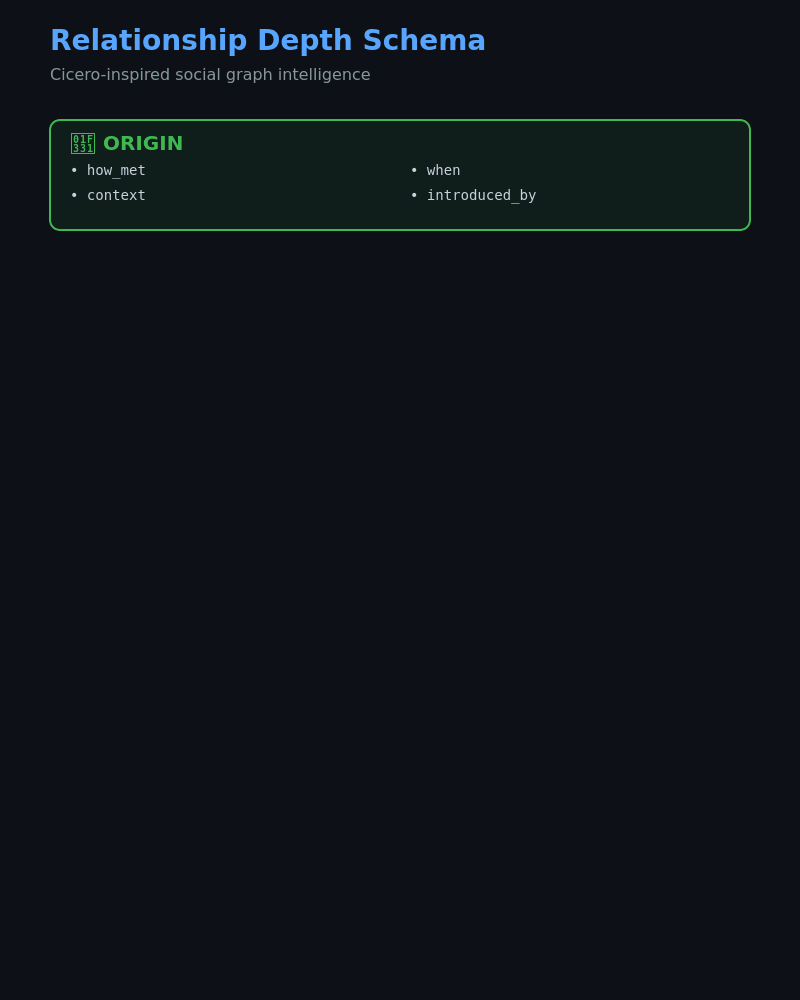

# DeepRuin Methodology

Frameworks for network intelligence and influence analysis.

## Core Frameworks

### 🧠 Relationship Depth Model (Cicero-Inspired)

A 6-layer model for understanding relationship quality beyond simple connections:

1. **Origin** — How you met, context, who introduced
2. **Interactions** — Frequency, reciprocity, channels, who initiates  
3. **Trust** — Level (1-5), signals, favors exchanged
4. **State** — Active/dormant/strained, trajectory
5. **Strategic** — Mutual value, shared interests
6. **Cicero Signals** — Intent model, cooperation probability, best approach

### 📊 Network Health Tracking

Real-time monitoring of relationship trajectories:
- **🟢 Active** — Interaction within 7 days
- **🟡 Warm** — Interaction within 30 days
- **🟠 Cooling** — Interaction within 90 days
- **🔴 Dormant** — No recent interaction

### 🎯 Engagement Channel Analysis

Multi-channel reachability scoring:
- Public channels (LinkedIn, Twitter)
- Private channels (Signal, SMS, Email)
- Engagement patterns (broadcast vs. responsive)

## Coming Soon

- Influence path optimization
- Reactivation timing models
- Network cluster analysis

---

*Building the science of professional relationships.*
